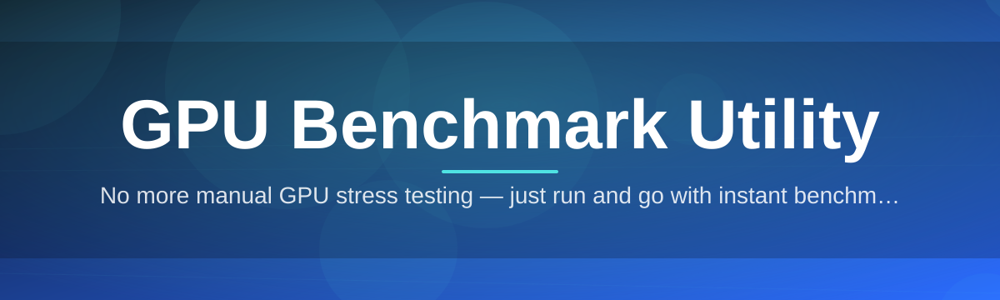
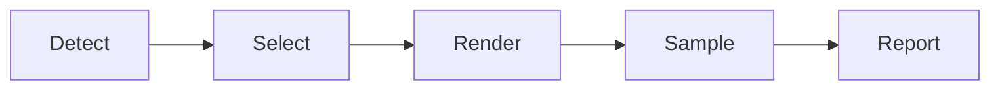

# gpu-benchmark-utility 🎮⚡

  

*Point it at your graphics card, press one key, and watch the numbers tell you the truth.*

  

## 🌱 Overview

Back in early 2025, a small group of hardware tinkerers got tired of juggling five different tools just to answer one question: "is my GPU actually performing the way it should?" Some tools were bloated with telemetry, others hadn't been updated since two GPU generations ago, and almost none of them agreed with each other on FPS counts. **gpu-benchmark-utility** started as a weekend script to reconcile those numbers and, a year later, grew into a full standalone benchmarking suite that thousands of PC builders, overclockers, and system integrators now trust as their daily driver.

At its core, this project is a GPU benchmark utility built for clarity over spectacle. It stress-tests your graphics card across synthetic rendering loads, logs thermal and clock behavior in real time, and hands you a report that actually means something — no marketing gloss, no inflated scores designed to sell you a subscription. Whether you're validating a fresh thermal paste job, comparing two GPU driver versions, or just curious how your card stacks up against reference numbers, this tool gives you a direct line of sight into what your silicon is doing under load.

It's built for a wide audience: hardware reviewers who need repeatable numbers, gamers chasing stable frame pacing, system builders validating a new rig before shipping it, and hobbyists who just enjoy watching a GPU sweat. There's no cloud account, no telemetry opt-out buried in a settings menu, and no dependency chain to wrestle with — download it, run it, get your answer.

---

## 🔥 What It Actually Does

> [!NOTE]
> Every capability below runs locally on your machine. Nothing is uploaded, nothing is phoned home — your benchmark data is yours.

- **Synthetic load orchestration** — Cycles through geometry-heavy, shader-heavy, and memory-bandwidth-heavy render passes so no single GPU strength or weakness dominates the final score.

- **Live thermal and clock telemetry** — Pulls core temperature, hotspot readings (where exposed), and boost clock behavior every frame, plotted as it happens rather than summarized after the fact.

- **Frame time consistency tracking** — Goes beyond average FPS to expose stutters, frame pacing dips, and the 1% / 0.1% low percentiles that actually determine how smooth something feels.

- **Driver-version snapshotting** — Records the exact driver build active during each run, so when you A/B two driver versions six months apart, you're comparing apples to apples.

- **Multi-GPU awareness** — Detects and lets you target a specific adapter in multi-GPU rigs, laptops with switchable graphics, or systems running integrated + discrete side by side.

- **Exportable result cards** — Generates a clean, shareable summary card (image + raw data) for forums, review write-ups, or your own historical archive.

- **Stress endurance mode** — An extended-duration run designed to reveal thermal throttling and long-session stability issues that a 60-second sprint would never catch.

- **Baseline comparison overlay** — Layers your current run against a previous saved run, or a bundled reference dataset, so regressions and gains are visually obvious.

  

---

## 🚀 Getting Off the Ground

1. **Visit the landing page.** Use the download button above or below — it's the only official source for the utility.

2. **Grab the latest build.** The page always serves the current stable release; no version hunting required.

3. **Run the executable.** No installer wizard, no background service — it opens straight into the benchmark dashboard.

4. **Pick a test profile and hit Start.** Your first result card will be ready in under two minutes for the quick-scan profile.

> [!TIP]
> First time running it? Use the **Quick Scan** profile before jumping into Endurance mode — it gives you a fast sanity check that your GPU and drivers are behaving before committing to a longer session.

---

## 🖥️ What Your System Needs

| Requirement | Minimum | Recommended |
|---|---|---|
| OS | Windows 10 (64-bit) | Windows 11 (64-bit) |
| GPU | Any DirectX 11-capable card | Dedicated GPU with 4GB+ VRAM |
| RAM | 4 GB | 8 GB+ |
| Storage | 150 MB free | 500 MB free (for saved result history) |
| Install | Not required | Standalone executable |
| Internet | Not required to run | Only needed for the initial download |

> [!IMPORTANT]
> This is a standalone Windows utility — there is no dependency installer, no runtime download, and no background updater. What you download is the complete tool.

---

## ⚙️ How It Works

The benchmark pipeline is intentionally simple to reason about, which is part of why its numbers are trusted:

1. **Detection** — The utility enumerates connected GPUs and confirms driver, VRAM, and adapter details.

2. **Profile selection** — You choose a test profile (Quick Scan, Standard, Endurance, or Custom).

3. **Load generation** — The engine renders the selected synthetic workloads while sampling telemetry every frame.

4. **Aggregation** — Frame times, clocks, and thermals are compiled into percentile-based metrics rather than flat averages.

5. **Reporting** — A result card is generated, optionally compared against a saved baseline.

---

## 🧩 Troubleshooting Corner

<strong>My score seems way lower than what I've seen online — is my card broken?</strong>

Not necessarily. Background apps, power plan settings, and even ambient room temperature can shift results noticeably. Close overlays, browsers, and recording software before running, and set your Windows power plan to High Performance.

<strong>The tool only detects my integrated GPU, not my dedicated card.</strong>

This usually happens on laptops with switchable graphics. Check your GPU control panel and force the benchmark executable to run on the discrete adapter, then relaunch.

<strong>Endurance mode causes a driver crash or black screen recovery.</strong>

This is almost always a thermal or power delivery limit being hit, not a bug in the utility itself. Lower your test resolution, check case airflow, and confirm your PSU headroom before retrying.

<strong>Can I run this on a laptop?</strong>

Yes — just expect more thermal throttling in longer profiles due to smaller cooling solutions. This is expected and actually useful data for laptop reviewers.

<strong>My result card export is blank or corrupted.</strong>

This typically points to insufficient disk permissions in the folder you're exporting to. Try exporting to your Documents folder instead of a system-protected directory.

<strong>Does this work with multi-monitor setups?</strong>

Yes, though for the most consistent numbers we recommend disabling secondary displays during a run, since compositing extra desktops can introduce minor frame time noise.

---

## 🎛️ Interface, Shortcuts & Personalization

The interface leans into a dark, data-dense aesthetic by default, with a light theme available for anyone benchmarking under bright studio lighting for content creation.

### Keyboard Shortcuts

| Key | Action |
|---|---|
| `Space` | Start / Pause current benchmark run |
| `Esc` | Cancel active run and return to dashboard |
| `Ctrl + S` | Save current result card |
| `Ctrl + E` | Export result as image |
| `Ctrl + B` | Toggle baseline comparison overlay |
| `Ctrl + T` | Switch between dark and light theme |
| `Ctrl + ,` | Open settings panel |
| `F1` | Open in-app quick help |
| `Tab` | Cycle between GPU adapters (multi-GPU systems) |

### Settings Highlights

- **Theme:** Dark (default), Light, and a high-contrast mode for accessibility

- **Telemetry sample rate:** Adjustable from per-frame to once-per-second, trading detail for lighter logging overhead

- **Overlay opacity:** Fine-tune the live telemetry overlay so it never obstructs the render preview

- **Result history:** Configurable retention — keep the last 10 runs or archive everything indefinitely

> [!TIP]
> If you're recording for a review video, switch to Light theme and reduce overlay opacity slightly — it reads far better on camera than the default dark dashboard.

---

## 🤝 Contributing & Community

This project grew from a weekend script into something thousands of people rely on, and that only happened because contributors kept showing up. Whether you're fixing a typo, adding support for a new telemetry source, or tackling a "good first issue," you're welcome here.

- Check the **Issues** tab for labels like `good first issue` and `help wanted` — these are scoped specifically for newcomers.

- Discussion threads are open for feature ideas before they become full pull requests, so nothing has to be perfect on the first attempt.

- Documentation improvements are just as valued as code — if something confused you, it probably confused someone else too.

> [!NOTE]
> No contribution is too small. Clarifying a confusing troubleshooting entry is just as valuable as shipping a new benchmark profile.

---

## 📜 License

Released under the [MIT License](LICENSE), 2026. Use it, study it, build on it.

---

## ⚠️ Disclaimer

gpu-benchmark-utility is provided as-is, for informational and diagnostic purposes. Stress-testing hardware inherently pushes components toward their thermal and power limits — always ensure adequate cooling and monitor your system during extended runs. The maintainers are not responsible for hardware damage resulting from misuse, inadequate cooling, or pre-existing hardware faults. Benchmark results are indicative, not guaranteed, and may vary based on system configuration, ambient conditions, and background processes.

